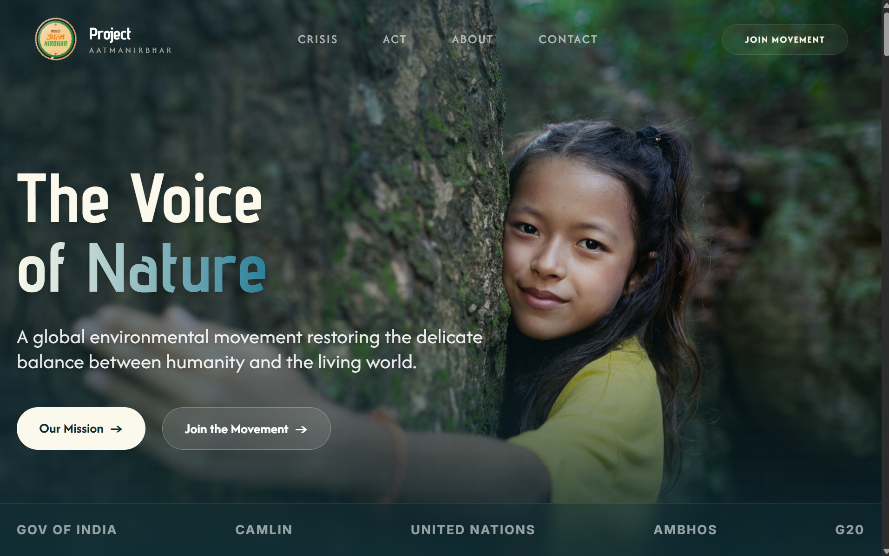

# 🌱 Aatmanirbhar - The Voice of Nature



[](https://reactjs.org/)
[](https://vitejs.dev/)
[](https://www.typescriptlang.org/)
[](https://tailwindcss.com/)
[](https://lucide.dev/)

> **"A global environmental movement dedicated to restoring the delicate balance between humanity and the living world."**  
> Project Aatmanirbhar is not just an organization; it is a collective pulse restoring the umbilical bond between humanity and the living world.

---

## 🏛️ The Three Pillars of Restoration

Inspired by Vedic wisdom, we address the fundamental elements of life through a holistic, action-driven approach:

| Element | Sanskrit Name | Focus Area | Goal |
| :--- | :--- | :--- | :--- |
| **Air** | **Vayu** | Urban Smog & Air Quality | Restoring the breath of life through scientific & community initiatives. |
| **Water** | **Jal** | River Rejuvenation (Yamuna) | Revivng sacred water bodies through bio-remediation and "Jan Bhagidari". |
| **Land** | **Bhumi** | Herbal Valley & Bio-Economy | Creating a living model of sustainable agriculture and medicinal forests. |

---

## ✨ High-Performance Features

### 🌪️ Crisis Documentation (Problems Page)
- **The Black Arteries:** Real-time documentation of Yamuna's health (Dissolved Oxygen level at 0.00 mg/L).
- **The Smog Monitor:** Tracking AQI peaks (999+), Daily Toxicity (equivalent to 22 cigarettes), and Pediatric Risks.
- **Industrial Malignancy:** Reporting on untreated industrial waste (Hexavalent Chromium at 14,000x over limit).

### 🤝 Action Modalities (Act Page)
- **Volunteer Force:** A platform for "Weekend Warriors" to participate in cleanup and reforestation drives.
- **Leadership Program:** A 3-month intensive immersion into Ecological Tech, Rural Relations, and Project Management.
- **Catalyst Investment:** Fueling carbon-neutral supply chains and empowering rural women through green economy initiatives.

### 🌿 Eco-Economy & Circularity
- **Waste to Value:** Innovation in transforming temple flower waste into high-quality incense.
- **Jan Bhagidari:** A unique model of Public Participation where community will meets biotechnology.

---

## 🎨 Premium Design System

The application boasts a **Cinematic, High-Contrast Aesthetic** designed to inspire action:

- **Visual Language:** A sophisticated blend of `brand-dark` (#0A0A0A), `brand-cream` (#FBF9EC), and `brand-teal` (#2B8098).
- **Typography:**
  - **Hero:** Impactful, bold headers for mission-critical messaging.
  - **Display:** Elegant serif-like fonts for storytelling and philosophy.
  - **Sans:** High-readability fonts for data and interactivity.
- **Interactions:** 
  - Smooth **Fade-in-up** entrance animations.
  - **Glassmorphism** effects with backdrop blurs and semi-transparent borders.
  - **Parallax Imagery** for an immersive scrolling experience.

---

## 🛠️ Tech Stack & Optimization

- **Core:** Built with **React 18** and **TypeScript** for type-safe, component-driven development.
- **Tooling:** **Vite** for lightning-fast HMR and building.
- **Styling:** **Tailwind CSS** for a utility-first, modern responsive UI.
- **Navigation:** **React Router Dom v7** for seamless SPA routing between Home, About, Act, and Problems pages.
- **Performance:** Optimized image delivery and asset management via Vite's build pipeline.

---

## 📊 Impact in Numbers

| 1988+ | 13+ | 29+ | 967+ |
| :---: | :---: | :---: | :---: |
| **Volunteers** | **Initiatives** | **Villages Adopted** | **Farmers Enrolled** |

---

## 📂 Repository Structure

```text
├── public/                # Static assets & cinematic imagery
│   ├── Thumbnail.png      # Project preview
│   ├── Yamuna.png         # Crisis visualization
│   └── logo.svg           # Brand identity
├── src/
│   ├── components/        # Reusable global UI
│   │   ├── Navbar.tsx     # Dynamic navigation
│   │   └── Footer.tsx     # Philosophy-led footer
│   ├── pages/             # Route-specific views
│   │   ├── Home.tsx       # Mission landing
│   │   ├── About.tsx      # Philosophy & History
│   │   ├── Act.tsx        # Action & Investment
│   │   └── Problems.tsx   # Critical Crisis Database
│   ├── index.css          # Tailwind & Design System tokens
│   └── main.tsx           # Entry point
├── tailwind.config.js     # Custom brand color & animation tokens
└── package.json           # Dependencies & Scripts
```

---

## 🚀 Getting Started

### Installation
1. **Clone the Project:**
   ```bash
   git clone https://github.com/DURVXSH/Totem-Assignment.git
   ```
2. **Install Dependencies:**
   ```bash
   npm install
   ```
3. **Launch Dev Server:**
   ```bash
   npm run dev
   ```

### Building for Production
```bash
npm run build
```

---

## 👤 About the Founder

**Shree Ranjeet Chaturvedi (Pathak)**  
*Affectionately known as **Yamuna Putra***  
A visionary leader from BrajBhoomi, Vrindavan, whose journey transition from a witness of crisis to a steward of environmental change has inspired 50,000+ volunteers globally.

---

### **made by durvesh**
[](https://github.com/DURVXSH)

> [Project Link](https://github.com/DURVXSH/Totem-Assignment) | Help Nature Breathe Again.
